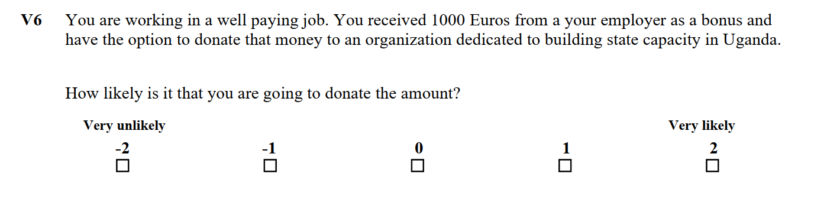

```{r first_setup, include=FALSE}
#Loading all the required packages
pacman::p_load(dplyr, # data management
               ggplot2, # plots
               psych, # detailed descriptives
               summarytools, # frequency tables
               olsrr, # Breusch-Pagan test
               sandwich, # Robust variance-covariance matrices
               lmtest, # Robust test of SE
               multiwayvcov, # Cluster standard errors
               stargazer,# Regression tables
               lme4, # Mixed-effects models
               sjPlot, # Tables for mixed-effects models 
               fastDummies,
               tidyverse,
               gridExtra,
               readr,
               broom) 
#Todo
#Reasearch summary

#Add sector control (US Patent type maybe?)
# Add NAs siehe anti_join(uspat_join,full_ops_query_data, by = c("uspto_fp_number_f_joining" = "ops_int_pat_number")))
```


``` {r loading_data, include=FALSE}
source("Data_preparation.R")
# Further data preparation
cond1 <- (df$origin == "gift_from_mother" & df$goals == "mothers")
cond2 <- (df$origin == "bonus" & df$goals == "entrepreneurs")
cond3 <- (df$origin == "tax_refund" & df$goals == "state_capacity")

df$equal <- ifelse(cond1 | cond2 | cond3, 1,0)
df$received <- df$received %>% as.numeric()
df$origin %<>% as.factor()
df$goals %<>% as.factor()

df$age <- 2020-df$year_of_birth

# Only Male and Income Rich Job significant 
#lm(donation ~ gender+income+received+channel+age+times_donated+amount_donated+
#     equal,
#   data = df)

#normalize donations
normalize <- function(x){
  if(sd(x) %>% is.numeric()) return((x-mean(x))/sd(x))
  else print("Error in normalizing")
}


df %<>% 
  group_by(befragten_id) %>%
  mutate("normaldonations" = normalize(donation))

```

## Research Summary:

This paper attempts to uncover the drivers of the willingness to donate through the usage of a Factorial Survey Experiment. We identified several of biases such as mental account whose impact on the donation willingness was assessed in this paper. However, we were not able to identify any of these biases that had a very strong and significant impact. We can however state with high confidence that the cause for which people donate matters immensely. While it may be considered common knowledge, this paper still adds to the literature by examining these hypotheses with a new and improved method increasing the ability to potentially make causal statements.

## Research Question:

**What are the drivers of donating money to charity?**

## Keywords
Factorial survey experiment, donation, nudging

\newpage

### Introduction 

Donations for humanitarian purposes are essential for many organizations and regions of the world. There is much research in the literature to understand why and how people donate money [@bennettFactorsUnderlyingInclination2003]. 
Although there are discussions about the efficiency and long-term effects of charitable donations and foreign aid [@sachsEndingAfricaPoverty2004], millions of people, through no fault of their own, find themselves in situations where donations are essential for survival. From this fact and the mandate of the UN Universal Declaration of Human Rights (ART 1 and 3) "All human beings are born free and equal in dignity and rights", "Everyone has the right to life, liberty and security of person". it follows that at this point it is not possible to refrain from making donations. 
In this study, we will not focus on the moral and economic implications of donations, but the literature on the positive effects is considerate. In this paper we are interested in understanding why people donate and what they donate for. The results of this experiment will help charitable organizations to better adapt fundraising to their specific circumstances. This should maximize the amount of money donated to charity and in the long-run result in higher welfare creation in developing nations enabled through increased donations. Summing it up this research is aiming to further the understanding of the following question: 
**What are the drivers of donating money to charity?**

## Theory and Methodology 
### The Factorial Survey Methodology 

Ample research in this field is normally based on empirical analyses of the donation behavior of specific population groups [@konrathDevelopmentValidationMotives2018]. While this approach reflects reality more accurately because it takes a multitude of factors into account when individuals make decisions, it is precisely here that the weakness of this analysis technique lies. Research into donation behavior can be argued to have a blind spot for both desirability bias / clear social norms and endogeneity baked into many of the analyses [@grimmSocialDesirabilityBias2010]. Although Factorial Surveys are not a new approach in the field, there is much potential in using them to better understand drivers of human judgment. Traditional surveys have to deal with the problem of multicollinearity which Factorial surveys can address through making sure that factors are orthogonal [@rossiMeasuringSocialJudgments1982]. This method combines the advantages of an experiment with those of a questionnaire. From surveys, Factorial Survey Experiments (FSE) takes the higher ability to achieve heterogeneous samples and therefore higher external validity and from experiments the higher internal validity through randomization of the instrument. Especially when focusing on one specific issue, Factorial Surveys can even be used to establish within-respondent comparisons by confronting the respondent to similar but slightly changed situations repeatedly, something that comes closer to having a true counter-factual than many other survey methodologies. Within-respondent comparisons will not be utilized in this paper as it falls beyond the scope of the research question.  Summarizing, using Factorial Survey Experiments allows a significantly easier argument for causality due to researchers to control a much higher number of factors. 


### Theoretical Background

In this section, we will explain the theoretical connections of individual variables and dimensions with the willingness to donate. The first variable is the origin of the money that the participant should imagine to have received. Several authors have already investigated how different origins of money can change the probability and amount of a donation. For example, Steinberg et al. find in their study "Inheritance and Charitable Donations" that inherited money has a significantly higher elasticity in donations than earned money. The theoretical argumentation used by the authors is the "Mental Accounting Theory" according to Shefrin and Thaler [@thalerMentalAccountingMatters1999]. Mental accounting is used in behavioural economics as an approach to explain the varying handling of different (objectively often equivalent) financial transactions. Thaler's analyses for empirical anomalies in orthodox economics and his analysis of mental accounting earned him a Nobel Prize in 2017. Accordingly, his theories are widely accepted and represent the modern basis for behavioural economics. 
In our study the variable takes the values: 

* Tax refund 
* Bonus
* Gift from mother 

The tax refund is a windfall gain where we expect the elasticity of the donations to be relatively high. (XXX) Furthermore, the variable should point out the positive aspects of a nation state (REVISION) and thus be linked to the aim of the donation. The interaction with the objectives of the donation will be examined in more detail at a later stage. The second variable, the bonus, represents the origin "earned money". Since the money itself was earned here, we assume that there will be a significantly lower elasticity and willingness to donate [@gasiorowskaMoneyCuesIncrease2016]. Because people feel as if they have a claim to the money. Furthermore, studies have already confirmed that people are driven into a "market mode" by self-earned money. Here people become less cooperative and less social. They live more according to the motto: "When everyone thinks of themselves, everyone is thought of"(ebd.). Lastly, we will focus on the expression "gift of the mother".  A gift from the mother is a windfall gain but is often connected with the norm that the money is spent for the own or common good. Therefore we expect that the willingness to donate will decrease ([@zelizerSocialMeaningMoney1989]).

In summary, our hypotheses regarding the first variable are:

* H1a: $\beta_{taxrefund} > 0$
* H1b: $\beta_{earnedmodey} < 0$
* H1c: $\beta_{giftfrommother} < 0$

The next two variables we will consider are the income of the person and the amount of money received by each participant. The income of a person is a variable that in most cases correlates positively with the amount of donations. (e.g. CHANG, Wen-Chun. "Determinants of donations") The participants in our study should imagine that they either have a "well paying job" or a "poorly paying job". Thus, we expect that the willingness to donate increases with rising income, i.e. with a positive manifestation of the binary coded variable "well paying job". Further, participants should imagine that they received varying amounts of money through the previously described channels. The values of this variable were logarithmically increasing: 10, 100 \& 1000 €. The range of values of the variable was determined by considering to what extent the amount of money would be logically compatible with the channels of money transfer. For example, a 10,000 € money gift from a mother would be an overloading of the participants' imagination. Equally unrealistic would be a 1 € bonus. 
The next variable that the participants were presented with was the goal of the humanitarian organisation. Three different variables were coded:

* Building State Capacity = Funding the completion of a new highway which will connect the two main cities in Uganda 

* Providing education for mothers = Funding courses for women preparing them for Birthgiving and Motherhood 

* Supporting Entrepreneurs = Funding Consulting-work for SMEs in rural areas 

Although it can be deduced from the literature that the goals of an organization are important determinants of the donation behavior of individuals, this was not the decisive determinant for our choice when coding the variables. (see Why Urban Poor Donate: A Study of Low-Income Charitable Giving in London) Our intention in coding the goals of the organisation was to link them to the origin of the money. Here we are once again taking up Thaler's Mental Accounting theory. If the income and expenses were in the same mental accounts of the participants it is expected that they will have less resistance to donate the money because no account will be "empty". If we look at Richard Thaler's most important work on this topic from 1999, we find this phenomenon in the first section of the first page. He explains: 
_"A few years ago I gave a talk to a group of executives in Switzerland. After the conference, my wife and I spent a week visiting the area. At that time the Swiss franc was at an all-time high relative to the US dollar, so the usual high prices in Switzerland were astronomical. My wife and I comforted ourselves that I had received a fee for the talk that would easily cover the outrageous prices for hotels and meals. Had I received the same fee a week earlier for a talk in New York though, the vacation
would have been much less enjoyable."_ In a later section, he elaborates that it was less painful to spend money in Switzerland because he had a Swiss lecture mental account that could not negatively impact his overall wealth as he was just being "filled". We expect that this will also be the case with the participants' donations. A gift from one's mother and Funding courses for women preparing them for giving birth and motherhood in Uganda will be included in one Mental Account, as will Thaler's Swiss journey. The same is true for a bonus resulting from ones own performance and the support of SMEs in developing countries. Finally, a tax refund and support for Uganda's state-building capacity should also be included in only one account. Across all of the organizations' goals, we have kept the country target constant for two reasons. First, Uganda is one of the poorest countries in the world. According to the CIA World Factbook, Uganda ranks 199th in the category GDP per Capita. While this does not necessarily say everything about the living standards and the welfare needs of the country's inhabitants, it is a good proxy. (https://www.cia.gov/library/publications/the-world-factbook/rankorder/2004rank.html) The low standard of living in the country where the aid is to go is supposed to confirm the donors' expectation that the people receiving the money will need it. The second reason is that we want to vary as few factors as possible between the different categories to guarantee the greatest possible validity of our estimators. Nevertheless, we will analyse the individual interaction effects separately to rule out the possibility that the mental linking of the accounts may not have worked for all examples. Furthermore, especially in the case of donations with the goal of motherhood, we will add an interaction with the variable gender. Our hypotheses for the variable "Goals of Donation" are therefore as follows: 


* H2: There will be a significant positive effect of the dummy variable "Equal" which takes the value 1 if the origin and the destination of the money are in the same mental account. So: $\delta_{equal} > 0$

* H2a: $\delta_{origin:mother} \times$  $\delta_{goal:mother}$ > 0 

* H2b: $\delta_{origin:taxrefund} \times \delta_{goal:state} > 0$

* H2c: $\delta_{origin:bonus} \times \delta_{goal:Entrepreneur} > 0$

The last relevant dimension is the channel of money transfer. Here we can state that money that has not yet been booked, and ,therefore, is not attributed to a mental account, can simply be spent. This also comes from the "Mental Accounting" theory.  If the participant is asked to imagine that he has not yet received the money and is asked if he would be willing to donate this money, he does not have to credit one of his mental accounts. We therefore expect that the willingness to donate money not yet received is significantly higher than the willingness to donate money already received. This leads us to the concretization of the last hypothesis: 

* H3: $\mu_{received} < \mu_{notreceived}$

### Survey operationalization

To be able to test these hypotheses, we use the beforementioned method of Factorial Survey Experiments:

The initial planning was to run this experiment as Pen-and-Paper Personal Interviews (PAPI). Due to the Covid-19 Pandemic, this was not feasible anymore. Therefore, we resorted to sending the PDF of the questionnaires to the respondents and asking them to print it and send it back. 

When creating the questionnaires a sampling strategy needs to be employed. However, our survey only has 5 dimensions with 3,3,3,2,2 levels. This means that we have a universe of 108 unique vignettes. Including 12 vignettes for each survey we able to survey the complete universe of vignettes in 9 surveys. We surveyed 17 individuals and each deck at least once which should increase the validity. Additionally by choosing 5 dimensions it was the goal to give the respondents enough detail so the description of the scenario was understandable without using their imagination while at the same time not overburdening the respondents.


For each of the twelve vignettes, we presented the respondent with five dimensions for which he or she had to respond to the question _How likely is it that you are going to donate the amount?_
The following dimensions that were explained above will be quickly summarized below to provide a clear overview:
  
* The working situation of the person who will be asked to donate. The available options are a minimum wage job and a well paying job. 
* The amount of money you receive. It can be either 10, 100 or 1000 Euros.
* The origin of the money. The available options were tax refund, gift from mother or a bonus from work.
* The channel of the money. This differentiates between whether you have yet to receive the money and can decide to redirect it to the cause or whether you have already received the money.
* Lastly, the goal of the donation which can be building state capacity in Uganda, supporting small businesses and entrepreneurs in Uganda or provide education for young mothers in Uganda.

The respondent is then asked about their likelihood of donating using a Likert Scale with 5 values. The extremes (-2 and 2) were labelled "Very unlikely" and "Very likely" respectively. 

Below you will find one example vignette as it was presented to the respondents:
  
  ```{r echo=FALSE, out.width='105%'}

```

In addition to these 12, vignettes we asked the respondents to answer 7 questions on themselves, more specifically gender, year of birth, country of residence and highest educational qualification were asked before the survey. After the survey the respondents were asked how difficult they through these imaginary descriptions were to rate, to how many different causes they have donated in 2019 and what the approximate amount of money they have donated in 2019. For the latter two questions one could refuse the answer.

## Results

Before looking at inferential statistics it is essential to get an overview over the data, starting with the properties of the respondents themselves:

```{r echo=FALSE, out.width='105%', warning=FALSE, fig.width=8, fig.height=3}
p1=ggplot(data=Responses, aes(x=gender)) + 
  geom_histogram(stat="count") +ylab("Count")+xlab("Gender")+
  ylim(0,15) + theme_minimal()
p2=ggplot(data=Responses, aes(x=degree)) +
  geom_histogram(stat="count") +ylab("Count")+xlab("Highest degree obtained")+
  ylim(0,15)+ theme_minimal()
grid.arrange(p1,p2,nrow=1)

```

For the sake of completeness, the distribution of value for the questions on the general difficulty of rating the situations, the number of times donated and the total amount donated is plotted below. For the difficulty -5 was very difficult and +5 was very easy. We can see that for most respondents it was challenging at most which means that we chose the number and content of the dimensions appropriately. However, this value can be improved upon for example through an extensive pre-test, which was out of the scope of this research endeavor.

The respondents were given the option to not give information on the latter two questions which resulted in 1 person not giving information of the number on times donated and three respondents for the total amount donated.

``` {r plotting_b_questions, include=TRUE, echo=FALSE, warning= FALSE}
p3 =ggplot(data=Responses, aes(x=difficulty)) + 
  geom_histogram(stat="count") +ylab("Count")+xlab("Difficulty")+
  xlim(-5,5) + theme_minimal()
p4 =ggplot(data=Responses, aes(x=times_donated)) + 
  geom_bar() +ylab("Count")+xlab("Times donated")+
  theme_minimal()
p5 =ggplot(data=Responses, aes(x=amount_donated)) + 
  geom_histogram(stat="bin",binwidth = 500) +ylab("Count")+xlab("Total amount donated")+
  ylim(0,15) + stat_bin(binwidth=500, geom="text", aes(label=..count..), vjust=-1.5) 
lay <- rbind(c(1,2),
             c(3,3))
grid.arrange(p3,p4,p5,layout_matrix =lay)
```


To give a short display of the data, the distribution of the main outcome variable is plotted below:

``` {r plotting_proportions, include=TRUE, echo=FALSE, fig.width=8, fig.height=4}
p6 = ggplot(data=df, aes(x=donation)) + 
        geom_bar(aes(y = (..count..)/sum(..count..))) +
        labs(title="Overall",
          x ="Willingness to donate", y = "Proportion") + 
        ylim(0,0.4) +
        theme_minimal()

p7 = ggplot(df[df$gender=="Male",], aes(x=donation)) + 
        geom_bar(aes(y = (..count..)/sum(..count..))) + 
        labs(title="Males",
          x ="Willingness to donate", y = "Proportion") + 
        ylim(0,0.4) +
        theme_minimal()

p8 = ggplot(df[df$gender=="Female",], aes(x=donation)) + 
        geom_bar(aes(y = (..count..)/sum(..count..))) + 
        labs(title="Females",
          x ="Willingness to donate", y = "Proportion") + 
        ylim(0,0.4) +
        theme_minimal()
grid.arrange(p6,p7,p8,nrow=1)

```

### Hypothesis testing

As informing as these descriptive plots were, we will now examine the hypotheses one by one to assess which we can to reject. For this, we have conducted three t-tests with $\mu = 0$, the results of which are displayed below:

```{r  results='asis', header=FALSE, message=FALSE, echo=FALSE, fig.width=8,fig.height=5}
t_test_mother=t.test(df$donation[which(df$origin == "gift_from_mother")],mu =  0)

t_test_bonus=t.test(df$donation[which(df$origin == "bonus")],mu =  0)

t_test_tax_refund= t.test(df$donation[which(df$origin == "tax_refund")],mu =  0)
# Unfortunately this needs is hardcoded
# TODO change that

t_tests=data.frame("Variable" = c("Tax refund","Bonus","Gift from mother"),
           "Mean" = c("-0.576","-0.083","-0.54"),
           "t-value" = c("-3.3849","-0.472","-3.178"),
           "p-value" = c(paste0(round(t_test_tax_refund[["p.value"]],3)," ***"),
                         round(t_test_bonus[["p.value"]],3),
                         paste0(round(t_test_mother[["p.value"]],3)," ***")
                         )
           ) 
stargazer(t_tests,summary=F, title = "T-test results | ***: p<0.01",header=FALSE)


```


\begin{table}[!htbp] \centering 
  \caption{} 
  \label{} 
\begin{tabular}{@{\extracolsep{5pt}} cccccc} 
\\[-1.8ex]\hline 
\hline \\[-1.8ex] 
 & Variable & Mean.of.x & Mean.of.y & t.value & p.value \\ 
\hline \\[-1.8ex] 
1 & Channel & -0.472 & 0.324 & -0.36747 & 0.713 \\ 
2 & Income & 0.230 & -1.04 & 7.0424 & 0.000 \\ 
\hline \\[-1.8ex] 
\end{tabular} 
\end{table}

Starting with the first hypothesis which states that $\beta_{taxrefund} > 0$ we can reject the hypothesis. 
For the hypothesis $H1b$  ($\beta_{earnedmoney} < 0$) we cannot reject the $H_0$ which would state that   $\beta_{earnedmoney} > 0$, so we must also reject the $H1b$.


We can, however, reject the Null-hypothesis for the $H1c$ which means that our data validate that $\beta_{giftfrommother} < 0$, as the theory predicts.

For the next hypotheses, we run four regression with robust standard errors clustered on the respondents displayed below:


```{r results='asis', header=FALSE, message=FALSE, echo=FALSE, fig.width=8,fig.height=5}
lm_origin_equal = lm(donation ~ equal, df)
lm_origin_equal$clse <- cluster.vcov(lm_origin_equal, df$befragten_id) 
lm_origin_equal_robust <- coeftest(lm_origin_equal, lm_origin_equal$clse)

lm_mother_equal = lm(donation ~ origin_gift_from_mother * goals_mothers, df)
lm_mother_equal$clse <- cluster.vcov(lm_mother_equal, df$befragten_id) 
lm_mother_equal_robust <- coeftest(lm_mother_equal, lm_mother_equal$clse)


lm_taxrefund_equal = lm(donation ~ origin_tax_refund * goals_state_capacity, df)
lm_taxrefund_equal$clse <- cluster.vcov(lm_taxrefund_equal, df$befragten_id) 
lm_taxrefund_equal_robust <- coeftest(lm_taxrefund_equal, lm_taxrefund_equal$clse)

lm_SME_equal = lm(donation ~ origin_bonus* goals_entrepreneurs , df)
lm_SME_equal$clse <- cluster.vcov(lm_SME_equal, df$befragten_id) 
lm_SME_equal_robust <- coeftest(lm_SME_equal, lm_SME_equal$clse)


stargazer(lm_origin_equal_robust, lm_mother_equal_robust, lm_taxrefund_equal_robust, lm_SME_equal_robust,
          title ="Regression Results with Clustered Standard Errors",
          dep.var.labels = c("Willingness to donate"),
         # column.labels = c("Equal origin (CSE) ","Mother (CSE)", " State (CSE)", "Individual (CSE)"),
          covariate.labels = c("Equal", 
                               "Origin: Gift from Mother","Goal: Mothers",
                               "Interaction effect: Mother",
                               "Origin: Tax refund","Goal: State capacity",
                               "Interaction effect: State",
                               "Origin: Bonus", "Goal: Entrepreneurship",
                               "Interaction effect: Individual"),
          align=TRUE,
          report= "vc*s",
          type="latex", 
          table.placement = "h!",
          header=FALSE,
          omit.stat=c("LL","ser", "F","adj.rsq"),
          no.space=TRUE,
          column.sep.width = "0.5 pt"
          )
```

Interestingly, these regressions do not confirm the mental accounting theory as we are not able to reject any $H_0$  for any of the four hypotheses at the 5 % significance level. For $H1c$ we could reject the $H_0$ at the 10 % significance level, however this is not the significance level we set as we do not want to invoke any Type I errors.  While it is unfortunate for this specific paper that we could not reject any of these hypotheses at the previously set 5 % significance level, it became clear for researchers in many fields that unreported null results are a major problem [@rosenthalFileDrawerProblem1979], which is why we report them here. 

Lastly, we want to test hypothesis H3. For this we again run a regression with robust clustered standard errors on the respondents:
``` {r results='asis', header=FALSE, message=FALSE, echo=FALSE, fig.width=8,fig.height=5}

lm_received = lm(donation ~ channel_direct_transfer , df)
lm_received$clse <- cluster.vcov(lm_received, df$befragten_id) 
lm_received_robust <- coeftest(lm_received, lm_received$clse)


stargazer(lm_received_robust,
          title ="Regression Results with Clustered Standard Errors",
          dep.var.labels = c("Willingness to donate"),
          covariate.labels = c("Not received ", 
                               "Constant (Received)"),
          align=TRUE,
          report= "vc*s",
          type="latex", 
          table.placement = "h!",
          header=FALSE,
          omit.stat=c("LL","ser", "F","adj.rsq"),
          no.space=TRUE,
          column.sep.width = "0.5 pt"
          )
```
We cannot reject the $H_0$ of the H3 as not receiving the money and therefore directly donating it is not statistically significant at any relevant significance level.


## Discussion and Limitations

This paper was able to show the benefits of Factorial Survey Experiments in theory-led validation of common hypotheses. In this case only one hypothesis could be confirmed/ one $H_0$ could be rejected: We can be fairly certain that received money with the goal of investing in mothers education are more likely to be donated. 

There are a number of limitations to this study. Firstly, is of course the sample size which is relatively low with only 17 respondents. However, due to the high number of vignettes that each answered (12 to be precise) we still have a fairly high n in the end (204). It is import to mention that the respondents were mostly male and relatively young which might introduce a selection bias.

Furthermore, as usual in research on donations, desirability bias can pose a challenge that this research approach tries to address by exposing the respondent  to theoretical situations under anonymity. This should counteract the desirability bias partly, but this cannot be proven in this context.  

Another limitation of survey design lies in the sampling. We could have increased the balance of the asked dimensions slightly by having one more person answer the second deck which would have meant a perfect double usage of the universe of vignettes.

## Bibliography


